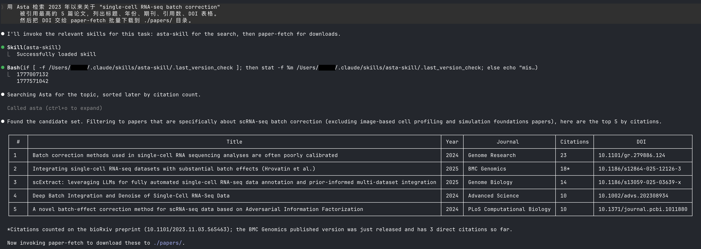
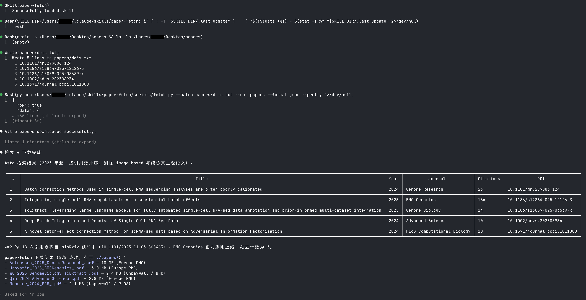

# asta-skill — Semantic Scholar via Ai2 Asta MCP 🔭

[中文文档](README_CN.md) | [Asta MCP Overview](https://allenai.org/asta/resources/mcp) | [Request API Key](https://share.hsforms.com/1L4hUh20oT3mu8iXJQMV77w3ioxm)

## What it does

- **Search** the Semantic Scholar academic corpus by keyword, title, author, or full-text snippet
- **Look up** a paper from any ID (DOI, arXiv, PMID, PMCID, CorpusId, MAG, ACL, SHA, URL)
- **Traverse citations** — find who cited a given paper, with filtering and pagination
- **Batch-lookup** multiple papers in one call via `get_paper_batch`
- **Snippet search** — retrieve ~500-word passages from paper bodies for evidence grounding
- **Author discovery** — find researchers and list their publications
- **Zero-code integration** — the skill is a pure instruction pack; all I/O goes through the Asta MCP server
- Triggers automatically whenever the user asks for papers, citations, academic search, or literature discovery and Asta tools are registered

## Multi-Platform Support

Works on any host that speaks MCP and loads [Agent Skills](https://agentskills.io) — verified on **Claude Code, Codex, Cursor, Windsurf, Hermes, opencode, OpenClaw/ClawHub,** and **[pi-mono](https://github.com/badlogic/pi-mono)**; indexed on **SkillsMP**. **LM Studio** (0.3.17+) supports MCP but does not auto-load skills — paste `SKILL.md` into the system prompt (see [LM Studio (manual mode)](#lm-studio-manual-mode) below).

## Prerequisites

- An agent host with MCP support (Claude Code, Codex, Cursor, Windsurf, opencode, OpenClaw/ClawHub, pi-mono, etc.)
- An Asta API key — [request here](https://share.hsforms.com/1L4hUh20oT3mu8iXJQMV77w3ioxm)

  ```bash
  export ASTA_API_KEY=xxxxxxxxxxxxxxxx
  ```

## MCP Server Registration

Register the Asta MCP server with your host **before** installing the skill.

### Claude Code

```bash
claude mcp add -t http -s user asta https://asta-tools.allen.ai/mcp/v1 \
  -H "x-api-key: $ASTA_API_KEY"
```

Then restart Claude Code so the MCP tools load at session start.

### Codex CLI

Edit `~/.codex/config.toml`:

```toml
[mcp_servers.asta]
type = "http"
url = "https://asta-tools.allen.ai/mcp/v1"
headers = { "x-api-key" = "${ASTA_API_KEY}" }
```

### Cursor / Windsurf / Hermes / other MCP clients

```json
{
  "mcpServers": {
    "asta": {
      "serverUrl": "https://asta-tools.allen.ai/mcp/v1",
      "headers": { "x-api-key": "<YOUR_API_KEY>" }
    }
  }
}
```

### LM Studio (manual mode)

LM Studio (0.3.17+) speaks MCP but does not auto-discover Agent Skills. Use it in two steps:

1. **Register the MCP server** — App Settings → Program → Integrations → edit `mcp.json`:

    ```json
    {
      "mcpServers": {
        "asta": {
          "url": "https://asta-tools.allen.ai/mcp/v1",
          "headers": { "x-api-key": "YOUR_ASTA_API_KEY" }
        }
      }
    }
    ```

2. **Paste the skill instructions** — copy the body of [`skills/asta-skill/SKILL.md`](skills/asta-skill/SKILL.md) into the chat's System Prompt so the model follows the intent routing and safe defaults.

Use a **tool-calling-capable** local model (e.g. Qwen2.5-Instruct, Llama 3.1 Instruct, Mistral Nemo, GPT-OSS). Plain chat models cannot invoke MCP tools.

## Skill Installation

The skill body lives at `skills/asta-skill/SKILL.md`. The easiest path is the plugin marketplace.

### Plugin marketplace (recommended)

```bash
# Any agent (Claude Code, Cursor, Copilot, etc.)
npx skills add Agents365-ai/365-skills -g

# Claude Code only
/plugin marketplace add Agents365-ai/365-skills
/plugin install asta
```

Also indexed on [SkillsMP](https://skillsmp.com/) and [ClawHub](https://clawhub.ai/) — each handles updates through its own marketplace.

### Manual clone (any host)

```bash
git clone https://github.com/Agents365-ai/asta-skill.git /tmp/asta-skill
cp -r /tmp/asta-skill/skills/asta-skill <your-host's-skills-dir>/asta-skill
```

## Usage

Just describe what you want:

```
> Use Asta to get the paper with DOI 10.48550/arXiv.1706.03762

> Search Asta for recent papers on mixture-of-experts at NeurIPS since 2023

> Who cited "Attention Is All You Need"? Show me the top 20 by citation count

> Find snippets in the Asta corpus that mention "flash attention latency"

> Look up Yann LeCun on Asta and list his 2024 papers
```

The skill picks the right Asta tool, attaches safe `fields`, and follows the documented workflow patterns.

### Example: Search + Batch Download (chained with `paper-fetch`)

`asta-skill` only handles **search and metadata**; it does not download PDFs. To go from a search query to local PDFs, chain it with a `paper-fetch` skill (or any DOI-based downloader of your choice):

```
> Use Asta to find the 5 most cited papers on "single-cell ATAC-seq batch correction"
  since 2022, then hand the DOIs to paper-fetch to download all PDFs into ./papers/
```

What happens under the hood:

1. **asta-skill** → `search_papers_by_relevance` with `publication_date_range="2022:"` and `fields=title,year,authors,venue,tldr,externalIds` (note `externalIds` to expose DOI)
2. Agent extracts `externalIds.DOI` for each hit; falls back to `externalIds.ArXiv` when DOI is absent
3. **paper-fetch** → batch-resolves each DOI/arXiv ID through Unpaywall → arXiv → bioRxiv/medRxiv → PMC → SS → Sci-Hub fallback chain
4. PDFs land in `./papers/`, one per paper

`paper-fetch` is a separate skill — install it if you need download capability. `asta-skill` itself stays scoped to the Semantic Scholar corpus.

**Step 1 — Asta returns the top 5 papers with DOIs:**



**Step 2 — paper-fetch downloads all 5 PDFs into `./papers/`:**



## Verification

After registering the MCP server and restarting your host, ask:

> "Use Asta to get the paper ARXIV:1706.03762 with fields title,year,authors,venue,tldr"

A successful call returns *Attention Is All You Need*, NeurIPS 2017, Vaswani et al., with TLDR.

## License

MIT

## Community

Join us for help, Q&A, and updates:

- **Discord:** https://discord.gg/79JF5Atuk
- **WeChat:** scan the QR code below

<p align="center">
  
</p>

## Support

If this skill helps you, consider supporting the author:

<table>
  <tr>
    <td align="center">
      
      <br>
      <b>WeChat Pay</b>
    </td>
    <td align="center">
      
      <br>
      <b>Alipay</b>
    </td>
    <td align="center">
      
      <br>
      <b>Buy Me a Coffee</b>
    </td>
    <td align="center">
      
      <br>
      <b>Give a Reward</b>
    </td>
  </tr>
</table>

## Author

**Agents365-ai**

- Bilibili: https://space.bilibili.com/441831884
- GitHub: https://github.com/Agents365-ai
